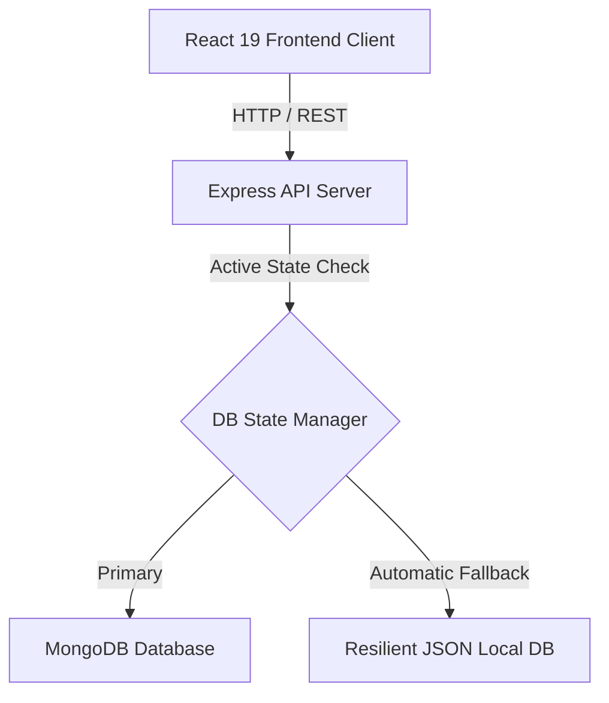

MCQ Quiz & Assessment Platform

A premium, highly interactive, and secure timed quiz and assessment platform modeled after Vercel, Stripe, and Linear design aesthetics. Built under a modern monorepo architecture with React 19, Tailwind CSS, and Node.js.

---

## Platform Architecture & Stack

The platform is divided into two distinct, high-performance service layers:



### 1. Backend API Services (`/backend`)
*   **Unified DB Access Layer**: Implements a highly resilient DB State Manager that primary-connects to MongoDB. If MongoDB is offline, it activates an automatic, zero-downtime **resilient fallback to a local JSON filesystem database** so the platform runs fully operational immediately out of the box!
*   **Seeded out of the box**: Automates seed checking to initialize default Student and Administrator credentials and interactive Web Development quizzes on first server boot.
*   **Secure Authentication**: Custom JWT-based stateless credential verification and protect middleware for dedicated role privileges.
*   **BulkBypass Loader**: Custom CSV and JSON parser enabling admins to import entire MCQ banks instantaneously.
*   **Telemetry Analytics Engine**: Compiles aggregate metrics, stacked percentage-based performance distributions, and global leaderboard rankings.

### 2. Frontend (`/frontend`)
*   **CSS Design System**: Engineered with customizable HSL variables, deep space-dark slate gradients, and glassmorphic panel boards.
*   **Lightweight Canvas Particle Field**: Avoids heavy WebGL libraries using a custom Canvas particles network that renders a floating mesh background at a buttery-smooth 60fps.
*   **Onboarding Gateway**: A stunning full-screen, two-column sign-in/up screen. Features an unmasked, high-definition background ambient loop, staggered slide-up entry animations using `framer-motion`, and a dynamic, clickable FAQ accordion panel that reveals timer and scorecard explanations on demand.
*   **Interactive Live MCQ Sandbox**: Spawns a 3-question MCQ Sandbox Player directly on the guest landing dashboard, allowing visitors to test knowledge and view instant negative marking point grading without needing credentials!
*   **Anti-Cheat Timed Engine**: A state-preserving countdown player that caches chosen answers in background storage. Closing the tab or refreshing the page **will not stop the clock** — preventing local client-side clock tampering!
*   **Scorecard Review Portal**: Post-submission or via the dashboard Completed Attempts table, users can inspect color-coded question cards highlighting correct options (**emerald green**), student choices (**rose red**), and skipped items.

---

## Default Seed Credentials

Upon first boot, the platform auto-seeds the following accounts for immediate evaluation:

| Role | Email | Password | Primary Console Privileges |
| :--- | :--- | :--- | :--- |
| **Administrator** | `admin@aura.com` | `admin123` | Create/edit quizzes, bulk upload CSV/JSON banks, inspect performance telemetry logs |
| **Student** | `student@aura.com` | `student123` | Take timed assessments, explore interactive previews, review leaderboard rankings |

---

## Installation & Quick Launch

Launch both backend API and frontend Vite servers concurrently following these steps:

### 1. Launch the Backend Server
```powershell
cd c:\Claudee\MERNN\backend
npm install
npm start
```
*Expected console telemetry:*
```text
Connecting to MongoDB at: mongodb://127.0.0.1:27017/quiz_platform...
MongoDB Connected Successfully! Host: 127.0.0.1
Database already populated. Skipping automatic seeding.
API Server running on port 5000...
Health Check URL: http://localhost:5000/api/health
```

### 2. Launch the Frontend Vite Client
In a second terminal window, run:
```powershell
cd c:\Claudee\MERNN\frontend
npm install
npm run dev
```
*Expected client console:*
```text
  VITE v5.4.21  ready in 150 ms

  ➜  Local:   http://localhost:5173/
  ➜  Network: use --host to expose
```

---

## Detailed Verification & Test Flows

### 0. Public Landing Dashboard &  Onboarding
1.  Open `http://localhost:5173/` in an incognito window.
2.  Answer the **Hero MCQ Sandbox** questions. Click **Compute Grade** to verify instant points calculation with simulated negative markings.
3.  Click **Launch Panel** on any public category.
4.  Observe the full-screen two-column **Sign Up / Sign In** page. Hover over Google/GitHub triggers, click the expandable platform questions in the left column, and test the secure **Password Toggle-Eye** button.
5.  Click **Back to Dashboard** to return cleanly.

### 1. Timed Student MCQ Assessment & Anti-Cheat
1.  Sign in as `student@aura.com` (password: `student123`).
2.  Launch the **Web Development Core Essentials** quiz.
3.  Answer multiple-choice options. **Refresh the page** or close the browser tab to verify that selected options are safely restored and the timer continues counting down without resetting!
4.  Upon completion, observe the graded scorecard and click **Review Answers** to inspect color-coded case highlights.
5.  Return to the dashboard and observe that the quiz card button is disabled and reads **"Assessment Completed"** to block duplicate attempt tampering.
6.  Click **Review** inside the *Completed Attempts Log* table to securely reload the past scorecard in review-only mode.

### 2. Bulk Loader & Performance Telemetry Logs
1.  Sign in as `admin@aura.com` (password: `admin123`).
2.  Observe the **Performance Distribution Chart** displaying stacked percentage brackets (Excellent, Good, Average, Poor).
3.  Under the chart, utilize the **Participant Performance Telemetry Log** table to search by student email or filter attempts by quiz categories.
4.  In the **Bulk Import Questions** module:
    *   Select an active quiz.
    *   Toggle **Paste JSON Text** and paste the following valid schema block:
    ```json
    [
      {
        "questionText": "What does ES6 stand for?",
        "options": ["ECMAScript 6", "Ecma Scripting 6", "Essential Scripting v6", "Elementary Script 6"],
        "correctAnswer": 0,
        "points": 4
      }
    ]
    ```
    *   Press **Trigger Bulk Import** and observe the instantaneous question count updates on your active assessments grid.

---

## Data Schemas & Telemetry Layouts

### Attempt Schema (`AttemptModel`)
Tracks granular student assessment stats:
```typescript
{
  userId: ObjectId,                // Ref: User
  quizId: ObjectId,                // Ref: Quiz
  answers: [
    { questionId: String, selectedOption: Number }
  ],
  score: Number,                   // Dynamic total graded value
  totalQuestions: Number,
  correctAnswersCount: Number,
  wrongAnswersCount: Number,
  skippedAnswersCount: Number,
  timeTaken: Number,               // Graded session time (seconds)
  completedAt: Date
}
```

### Quiz Schema (`QuizModel`)
Controls timers and negative marks:
```typescript
{
  title: String,
  description: String,
  timeLimit: Number,               // Timer duration (minutes)
  negativeMarking: Number,         // Penalty value (points deducted per wrong answer)
  difficulty: 'easy' | 'medium' | 'hard',
  createdBy: ObjectId              // Ref: User (Admin)
}
```

---

## Development & Code Quality Control
*   **Tailwind Compilation**: Execute `npm run build` in the `frontend` directory to bundle assets. The Vite bundler builds all modules into single CSS/JS packages with 0 warnings or errors in less than 15 seconds.
